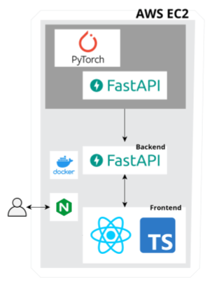

# 구미구미 마이구미, 간다

## 프로젝트 소개


```
SSAFY 6기의 구미 기업연계반, 🍇구미구미 마이구미 팀🍇입니다.

GAN을 활용한 AI 학습용 이미지 생성 시스템 개발 with 삼성전기, Gan-Da를 개발합니다.
```

## 주요기능


- 이미지 생성 및 다운로드
- 학습 모델 업로드 및 다운로드

## 세부기능

| 구분 | 기능 | 설명 |
| --- | --- | --- |
| 1 | 이미지 생성 및 다운로드 | GAN을 활용하여 학습된 모델을 기반으로 가상의 이미지를 생성할 수 있음. 생성된 이미지 다운로드 가능 |
| 2 | 학습 모델 업로드 및 다운로드 | 학습된 모델을 웹상에 업로드 및 다운로드 가능 |

## 기술 스택

- AI
    - PyTorch
- BE
    - Python
    - FastAPI
- FE
    - React18
    - TypeScript
    - mui

## 아키텍쳐



## 팀 소개

반 : SSAFY 6기 기업연계반

팀 이름 : 🍇구미구미 마이구미🍇

팀장 : 이영준(BE)

팀원 : 권도형(AI), 윤효전(FE/INFRA), 지현배(FE), 홍태균(AI)

---

[AI](ai/README.md)

[BACKEND](backend/README.md)

[FRONTEND](frontend/README.md)

## 서비스 소개 페이지

[https://k6s106.p.ssafy.io/](https://k6s106.p.ssafy.io/)
